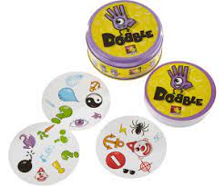
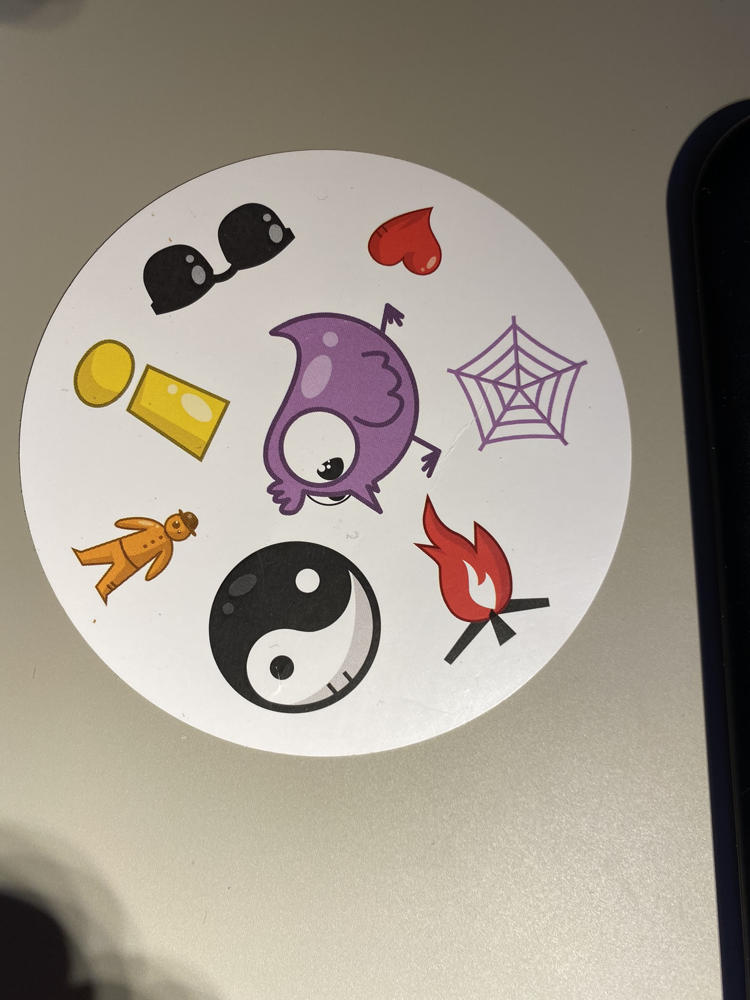
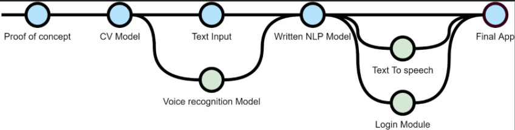
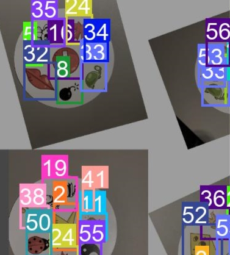
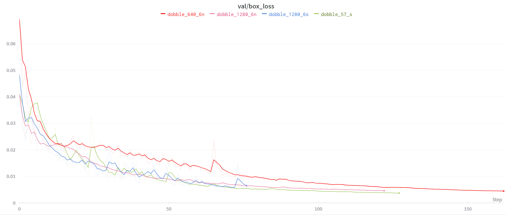
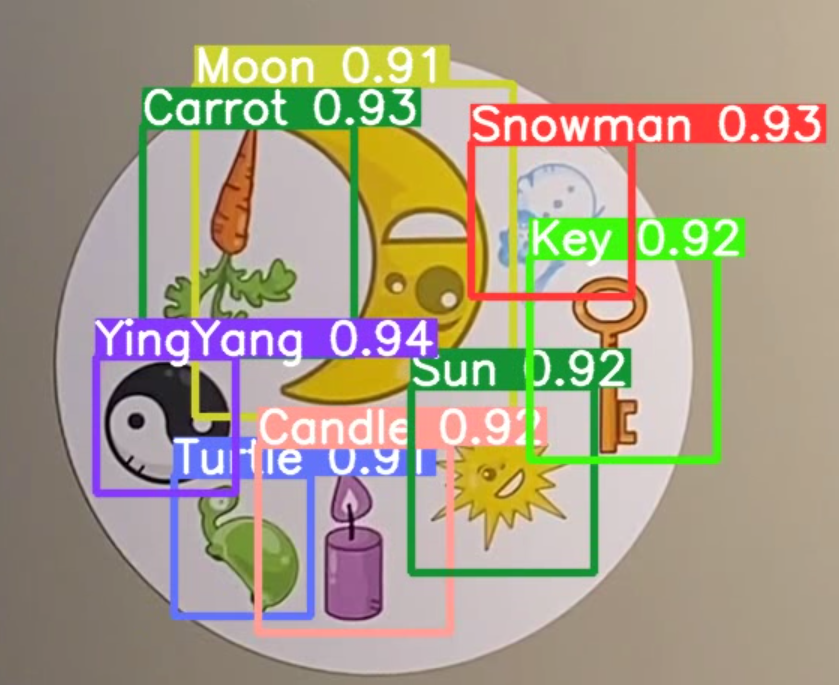

# Dobble

I have done this project as milestone for the end of my training as AI Engineer at Strive School.

## Introduction

Dobble is a card game where 57 symbols are printed 8 at a time in 56 cards. In every pair of cards there is always a repeated character.

My project ideas was to train a CV model to be able to recognize these symbols and therefore build a basic game around it.

For starters the dataset has to be done. That implied that the pictures have to be made, the classes have to be defined and the data labelled.

After the training has been done, it is possible to start building an application around it.

### Steps done

The final project should be able to be fully interactive with voice with no inference of keyboard. The idea is that when starting the application a NLP module will handle a casual chat and when the user says “let’s play”, the Cv module come into action.

The project covers:

This means that a CV Module, an NLP Module and an User Interface module with (speech recognition) has to be done.

I decided that the NL and the CV models will be hosted externally and the the communication with them will be via API. Therefore the following structure was implemented.
/docs/Structure.png

The images will be sent to the CV module and the classes will be returned back.

In the same way the text for the casual chat will be sent to the model and the answer will be sent back.

### CV Module

The first approach tested was using OpenCV and detecting contours, the results were promising, so I turned to Yolo and started annotating the images.

After all the training the model was working properly, with confidence over 90% almost all the cases. There was no much difference in a 1280px model than 640px.

[Performance Video](https://drive.google.com/file/d/1ZfHFnFGIRWU2Ih7t9By39fMDghumqVg_/view?usp=sharing)

## Folder Structure

How this GitHub is structured

- docs

  Here are some images and other information used by these Readme.md

- docker_files.

  Here are the source files for the docker images for the NLP and the CV modules.

  - CV  
The weights are not included in the file because of their size but you can get the docker image from 
[here](https://hub.docker.com/repository/docker/reeavsr/mirinda)

  - NLP

Here are all the files to generate the docker coin trainer. In case you want the docker image, you can get it from [here](https://hub.docker.com/repository/docker/reeavsr/sinalco)

- ST_App

  Streamlit application.

- Data

  The images needed to run the application. (it would have been nice to do it with live imaging but my computer has its limitations). Due that Dobble is a registered game, I am not uploading the images. 

## How to install it and run it

### Download it 

### Dockerize NLP

Open your terminal and supposing you have your docker installed build it, go to the folder where the  

`docker build -t nlp . `

And to run it do it with:

`docker run --rm -it -p 8001:8000 nlp`

### Dockerize CV

Remember that I am not supplying the weights due to their size, but here is how it should be done.

`docker build -t cv .`

And to run it do it with:

`docker run --rm -it -p 8002:8000 cv`

With both docker up and running we can run our app locally 

1. Make an **virtualenv** with the name you like.

2. Install the modules needed in *requiments.txt*

   `pip install -r requirements.txt`

3. Activate the environment.

4. Run the **streamlit** app. 

   `streamlit run ST_app.py` (if you are not in the *ST_app* folder you will have to give the path)

